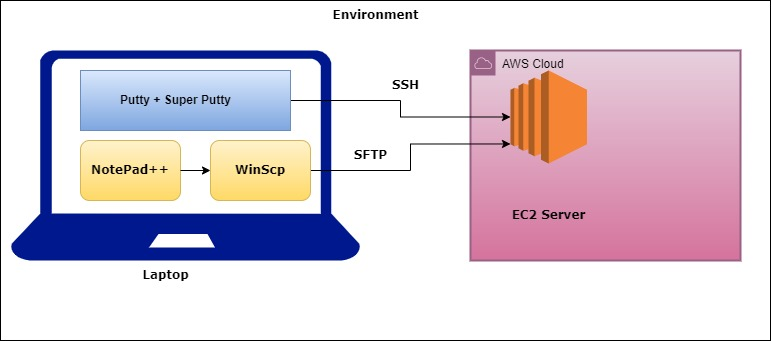

# Cntents <br/>
* **Shell Introduction**
* **Programming vs Scripting**
* **Simplyfying the code**
# Shell Concepts <br />
* **Variables**
* **Exit codes**
* **Conditions**
* **Loops**
* **Functions**
* **Log redirections**
* **Sheduling using Crontab**
# Projects <br />
* **Deleting the old log files**
* **CPU and Memory utilisation using Shell**
* **Instakking Docker using Shell**
* **Student Project Installation**

### Shell Scripting

**YouTube PlayList: https://www.youtube.com/playlist?list=PL1jY4BuFJn1cLJ2WCSeQbY0g4ye9gOgEI** 

I am going to cover everything in shell scripting from basics to advanced.

**Pre-requisite:** Linux basic knowledge

#### Environment Setup

https://www.youtube.com/watch?v=AZEX9f_kXcE&list=PL1jY4BuFJn1cLJ2WCSeQbY0g4ye9gOgEI&index=1&t=489s

* You should have AWS account
* Personal laptop with the below tools
    * Putty
    * Super Putty
    * WinScp
    * Notepad++



### OS used

I am mostly using AWS Linux 2. You can use any OS like Ubuntu, Centos, etc. Few commands will be changed based on OS.

* For Ubuntu username is ubuntu.
* For Centos username is centos.
* For AWS Linux 2 username is ec2-user.

### Linux

We are creating Linux servers in AWS Cloud. Don't create servers in your laptops that consume lot of memory. Use free trail of AWS account.

**NOTE: Delete EC2 after practice**

Make sure your security group has access to port number 22.

Once you create the server, you need to use ssh command to login to the server.

```
ssh -i <path-to-pem-file> username@IP-Adress
```

$ - denotes normal user <br/>
\# - denotes root user